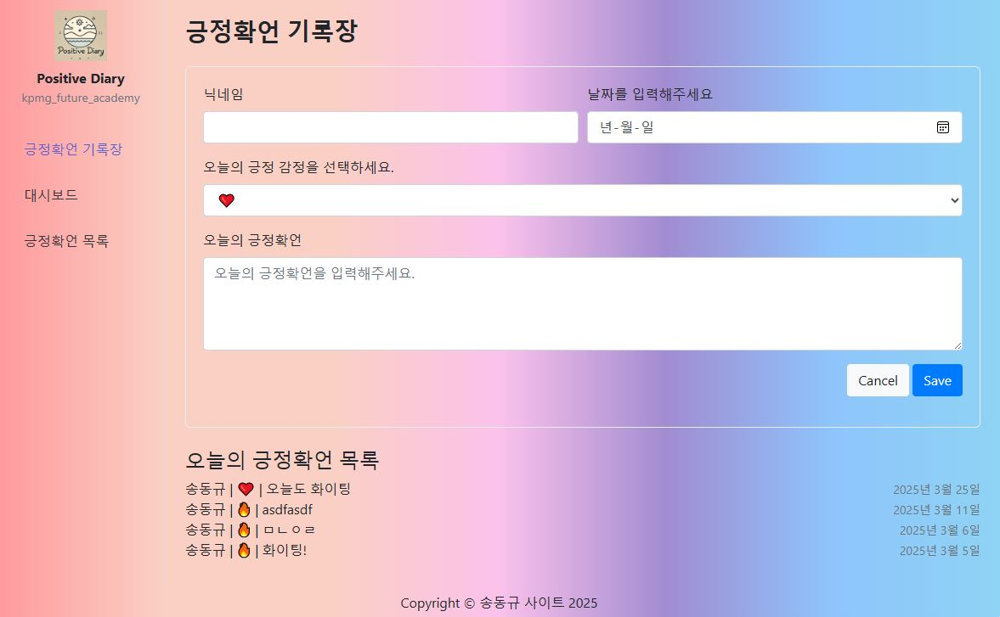

# django_diary2

```
# 장고 프로젝트 생성
django-admin startproject 프로젝트명

# 기본 DB 만들기
python manage.py migrate

# 슈퍼 유저 생성
python manage.py createsuperuser

# 장고 앱 만들기
python manage.py startapp 앱명

# settings.py
ALLOWED_HOST = ['localhost', '127.0.0.1']
LANGUAGE_CODE = 'ko-kr'
TIME_ZONE = 'Asia/Seoul'
import os
'DIRS' = [os.path.join(BASE_DIR, "templates")]
INSTALLED_APPS = [ ..., '앱명',]
```

```
# 완성본 이미지

```